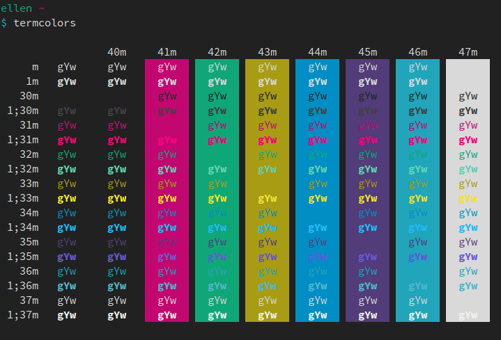
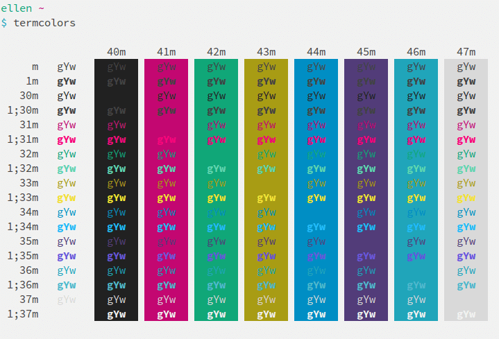

# Pencil for various terminals

A colorscheme inspired by iA Writer, adapted for terminals like [urxvt](http://software.schmorp.de/pkg/rxvt-unicode.html) and [termite](https://github.com/thestinger/termite) from [@reedes](https://github.com/reedes)' [original Vim version](https://github.com/reedes/vim-colors-pencil).

## Screenshots

### Dark

### Light

